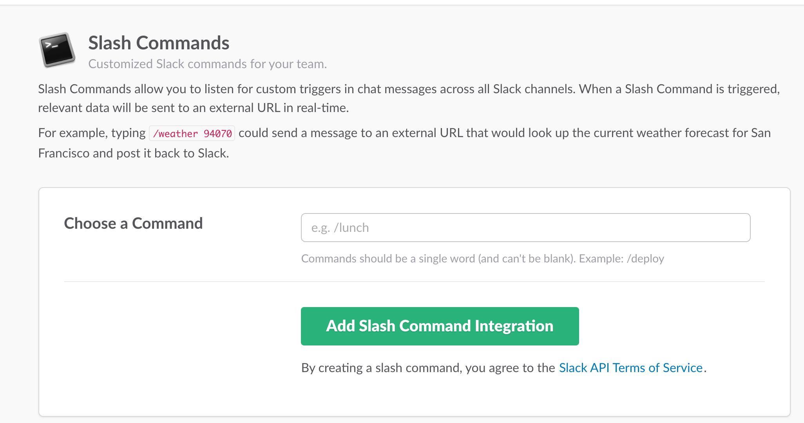
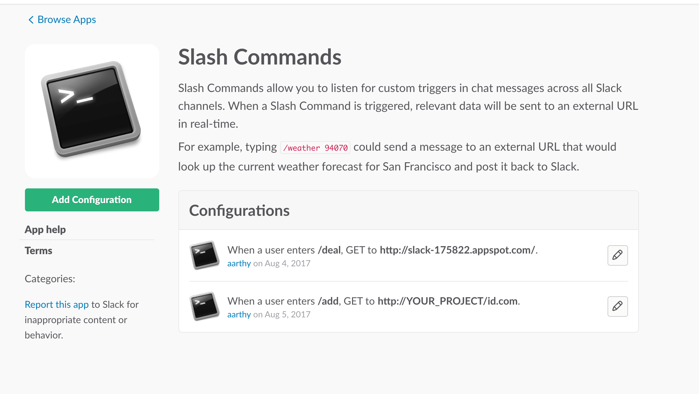
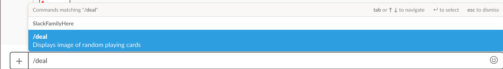
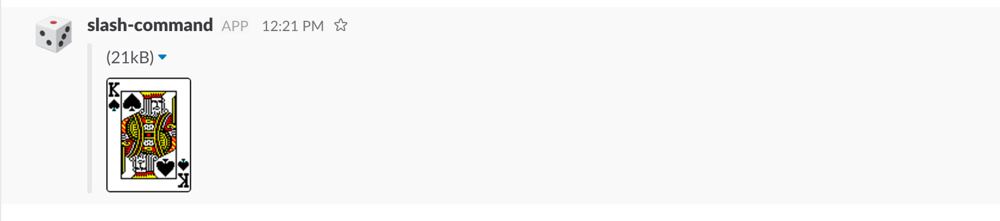

# Create slash command
Create a slash command to draw a random playing card and display an image of it.

# Getting Started
These instructions will get you a copy of the project up and running on your google app engine on cloud for development and testing purposes. 

# Prerequisites
Setup Google App Engine in cloud, Python 2.7, Download images for deck of cards.

# What is Slash Slack Commands
A slash command takes whatever text you enter after "/ " and will be sent to the configured external URL via HTTP Methods. Then it receives whatever that URL returns and posts it as a message in Slack. By default this message visible only to the person who issued the command but here it is modified so it is available to all in the channel.

# What is in the code
The code is going to take the input from the slash command “/deal” sends it to external backend server which is configured and running in Google cloud app engine. The python code is triggered and it will pick up the random playing card number and send the image of the card as response. The result is send in json format.

# Setup and Integration of Slash command:
Create Team:
If you don’t have your own test team account,create one to get started or join existing team.
For example, you can join my team I have created
Team:SlackFamilyHere
https://slackfamilyteamhq.slack.com

Set up your slash command:
Sign in to your Slack account and go to https://slack.com/apps/A0F82E8CA-slash-commands to add a new slash command.
Click the “Add Configuration” button to start the process.

Next,choose the text command that the user will type after the slash. In this case, “deal”. But you can use whatever makes the most sense for your command. 
Then click on Add Slash Command Integration.
Then it will open up a detailed configuration screen for the “/deal” command and you need to go down to a section that is titled Integration Settings and enter the values as shown below for
Command: /deal
URL: http://slack-projectidfromgoogle.com
Method: GET
Note that the value in URL field is your Google Cloud Platform project ID that you created earlier.
It is nice to select an Autocomplete Help Text for your Slash command.

For now, you can leave everything else empty. Just scroll down to the bottom and click the "Save Integration" button.
Now you can see all the slash command configured for your team on 
https://slackfamilyteamhq.slack.com/apps/A0F82E8CA-slash-commands
  

These commands can be either disabled or edited at any time.
In default, all the slash commands are ephemeral, sent as a private message.
It can be made displayed publicly by setting “response_type” as in_channel in the code. 

Slash command In Action;
Now that we have deployed our Slash command and configured the Custom Integration for our Slack Team, all we need to do is to see in action.
The format of the Slash command is:

 

This invokes our Slash Command handler that is hosted in Google App Engine and it comes back with a response.
 

Ref: 
https://api.slack.com/slash-commands
https://api.slack.com/docs/messages
http://www.girliemac.com/blog/2016/10/24/slack-command-bot-nodejs/
https://rominirani.com/slack-slash-command-tutorial-8f78a5a2ea4a
